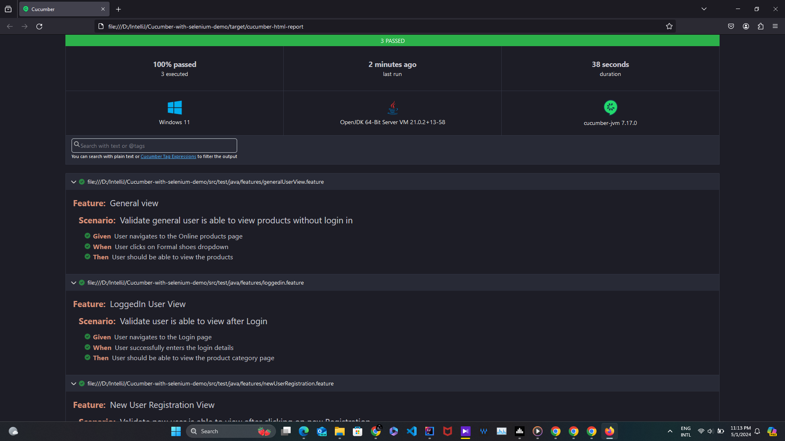
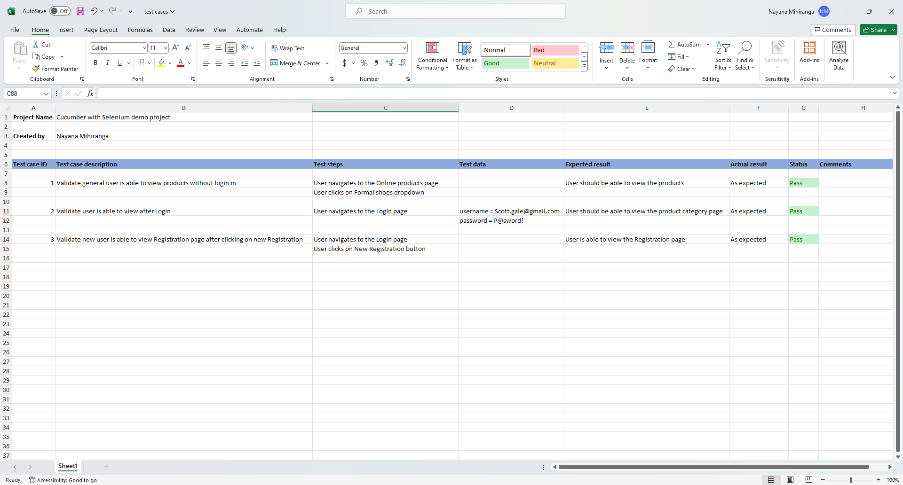

<h1 align="center">Cucumber with Selenium demo</h1>  

  This is a MAVEN project about setting up the Cucumber framework with Selenium in a Page Object Model concept along with the Web driver manager library. Here I have used three simple automated test cases. Also, I have generated a test automation report.

---

  Selenium | Cucumber | Java | Test Automation

---

### Test Report:

 

### Test Cases:

